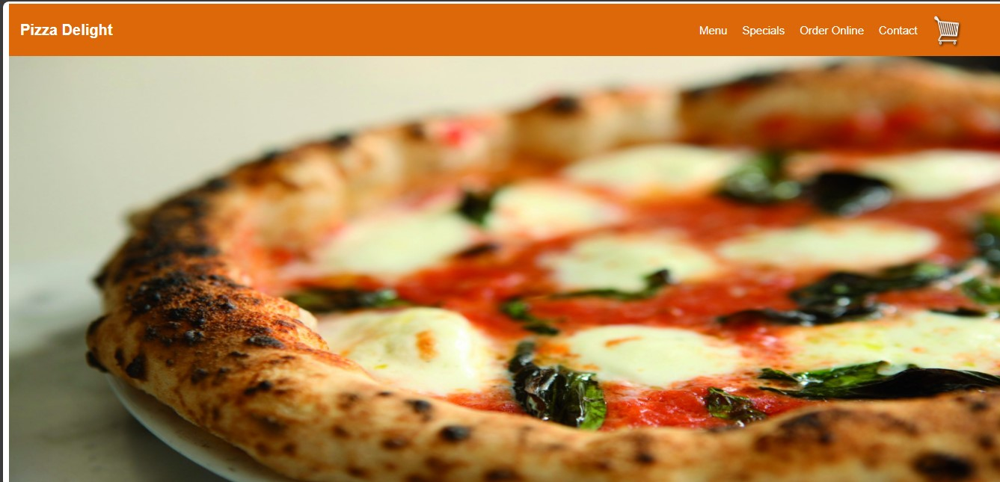
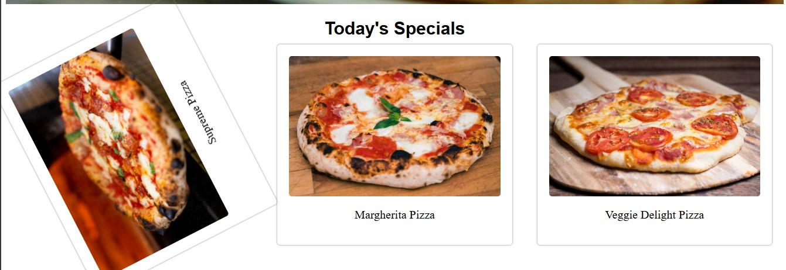
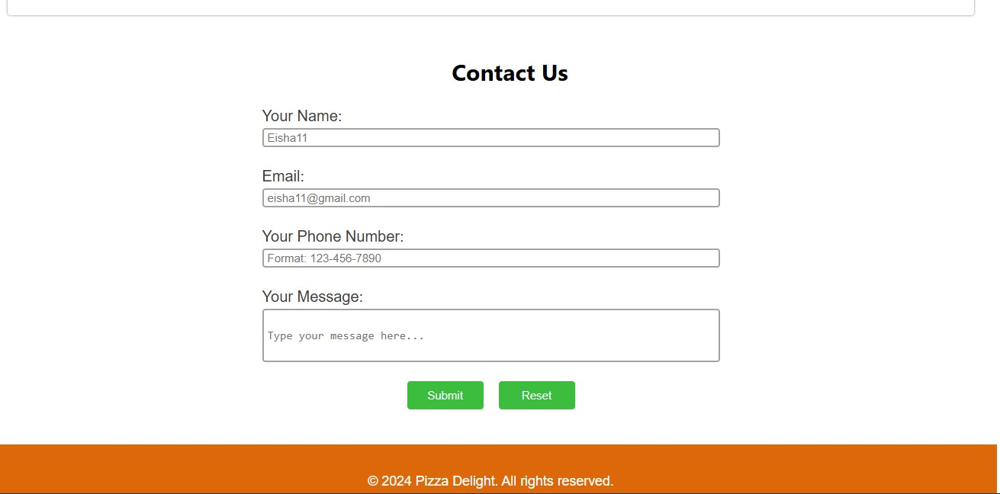

# 🍕 Pizza Delight – WebPage

A simple and responsive **restaurant homepage** built with **HTML & CSS**.  
It showcases a fictional pizza restaurant with a clean layout, animated image slider, and a working contact form.

---

## ✨ Features

- 🏷 **Header & Navigation Bar** – Logo and menu links (Menu, Specials, Order Online, Contact)
- 🎞 **Image Slider** – Smooth auto-sliding hero images using pure CSS
- 🍕 **Specials Section** – Highlighted pizzas with unique hover animations
- 💬 **Customer Testimonials** – Displayed with clean typography
- 🛎 **Call-to-Action** – Order Now button with hover effect
- 📞 **Contact Form** – Validated inputs for name, email, phone, and message
- 🎨 **Modern Design** – Flexbox layout, box shadows, and smooth animations

---

## 🖼 Screenshots

<p align="center">
  
  
  
  
</p>


---

## 🛠 Technologies Used

- **HTML5** – Structure and semantic layout  
- **CSS3** – Flexbox, animations, keyframes, responsive design  

---

## 📦 How to Use

1. Clone the repository:
```bash
git clone https://github.com/yourusername/pizza-delight.git
cd pizza-delight
```
Open index.html in any web browser to view the page.


